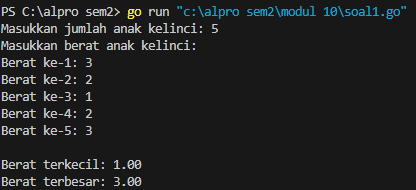
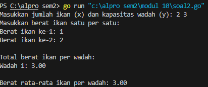
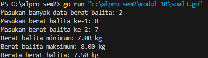

# <h1 align="center">Laporan Praktikum Modul 10<br>Nilai Ekstrim</h1>
<p align="center">Chilya Fadhilatin Nisa - 103112430010</p>

## Dasar Teori
Pencarian adalah suatu proses yang lazim dilakukan di dalam kehidupan sehari-hari. Contoh penggunaannya dalam kehidupan nyata sangat beragam, misalnya pencarian file di dalam directory komputer, pencarian suatu teks di dalam sebuah dokumen, pencarian buku pada rak buku, dan contoh lainnya. Pertama pada modul ini akan dipelajari salah satu algoritma pencarian nilai terkecil atau terbesar pada sekumpulan data, atau biasa disebut pencarian nilai ekstrim.
# Unguided
___
# SOAL LATIHAN MODUL 10
### No. 1
Sebuah program digunakan untuk mendata berat anak kelinci yang akan dijual ke pasar. Program ini menggunakan array dengan kapasitas 1000 untuk menampung data berat anak kelinci yang akan dijual.

```go
package main

  

import (

    "fmt"

)

  

func main() {

    var N int

    var berat [1000]float64

  

    fmt.Print("Masukkan jumlah anak kelinci: ")

    fmt.Scan(&N)

  

    if N <= 0 || N > 1000 {

        fmt.Println("Jumlah anak kelinci harus antara 1 sampai 1000.")

        return

    }

  

    fmt.Println("Masukkan berat anak kelinci:")

    for i := 0; i < N; i++ {

        fmt.Printf("Berat ke-%d: ", i+1)

        fmt.Scan(&berat[i])

    }

  

    min := berat[0]

    max := berat[0]

  

    for i := 1; i < N; i++ {

        if berat[i] < min {

            min = berat[i]

        }

        if berat[i] > max {

            max = berat[i]

        }

    }

  

    fmt.Printf("\nBerat terkecil: %.2f\n", min)

    fmt.Printf("Berat terbesar: %.2f\n", max)

}
```

> Output


- Program menggunakan array berkapasitas 1000.
    
- Input pertama adalah jumlah kelinci.
    
- Dilanjutkan dengan input berat kelinci satu per satu.
    
- Menggunakan perulangan untuk menentukan nilai **terkecil (min)** dan **terbesar (max)**.
    
- Output akhir adalah 2 bilangan riil: berat terkecil dan terbesar.

### No. 2
Sebuah program digunakan untuk menentukan tarif ikan yang akan dijual ke pasar. Program ini menggunakan array dengan kapasitas 1000 untuk menampung data berat ikan yang akan dijual.

```go
package main

  

import (

    "fmt"

)

  

func main() {

    var x, y int

    var ikan [1000]float64

  

    fmt.Print("Masukkan jumlah ikan (x) dan kapasitas wadah (y): ")

    fmt.Scan(&x, &y)

  

    if x <= 0 || x > 1000 || y <= 0 {

        fmt.Println("Input tidak valid. Jumlah ikan harus 1-1000 dan kapasitas wadah minimal 1.")

        return

    }

  

    fmt.Println("Masukkan berat ikan satu per satu:")

    for i := 0; i < x; i++ {

        fmt.Printf("Berat ikan ke-%d: ", i+1)

        fmt.Scan(&ikan[i])

    }

  

    jumlahWadah := (x + y - 1) / y

    totalWadah := make([]float64, jumlahWadah)

  

    for i := 0; i < x; i++ {

        idx := i / y

        totalWadah[idx] += ikan[i]

    }

  

    fmt.Println("\nTotal berat ikan per wadah:")

    for i := 0; i < jumlahWadah; i++ {

        fmt.Printf("Wadah %d: %.2f\n", i+1, totalWadah[i])

    }

  

    var totalSemua float64

    for i := 0; i < jumlahWadah; i++ {

        totalSemua += totalWadah[i]

    }

    rataRata := totalSemua / float64(jumlahWadah)

  

    fmt.Printf("\nBerat rata-rata ikan per wadah: %.2f\n", rataRata)

}
```

> Output


- **`x`** = jumlah ikan
    
- **`y`** = jumlah ikan per wadah
    
- Ikan disimpan dalam array tetap `[1000]float64`
    
- Berat total tiap wadah dihitung berdasarkan urutan input
    
- Jumlah wadah ditentukan dengan pembulatan ke atas `(x + y - 1) / y`
    
- Output:
    
    - Total berat per wadah
        
    - Berat rata-rata per wadah

### No. 3
Pos Pelayanan Terpadu (posyandu) sebagai tempat pelayanan kesehatan perlu mencatat data berat balita (dalam kg). Petugas akan memasukkan data tersebut ke dalam array. Dari data yang diperoleh akan dicari berat balita terkecil, terbesar, dan reratanya

```go
package main

  

import (

    "fmt"

)

  

const MAX = 100

  

type arrBalita [MAX]float64

  

func hitungMinMax(arrBerat arrBalita, n int, bMin *float64, bMax *float64) {

    *bMin = arrBerat[0]

    *bMax = arrBerat[0]

    for i := 1; i < n; i++ {

        if arrBerat[i] < *bMin {

            *bMin = arrBerat[i]

        }

        if arrBerat[i] > *bMax {

            *bMax = arrBerat[i]

        }

    }

}

  

func rerata(arrBerat arrBalita, n int) float64 {

    var total float64 = 0

    for i := 0; i < n; i++ {

        total += arrBerat[i]

    }

    return total / float64(n)

}

  

func main() {

    var berat arrBalita

    var n int

  

    fmt.Print("Masukan banyak data berat balita: ")

    fmt.Scan(&n)

  

    if n <= 0 || n > MAX {

        fmt.Println("Jumlah data tidak valid!")

        return

    }

  

    for i := 0; i < n; i++ {

        fmt.Printf("Masukan berat balita ke-%d: ", i+1)

        fmt.Scan(&berat[i])

    }

  

    var minBerat, maxBerat float64

    hitungMinMax(berat, n, &minBerat, &maxBerat)

  

    rata := rerata(berat, n)

  

    fmt.Printf("Berat balita minimum: %.2f kg\n", minBerat)

    fmt.Printf("Berat balita maksimum: %.2f kg\n", maxBerat)

    fmt.Printf("Rerata berat balita: %.2f kg\n", rata)

}
```

> Output
> 

**`arrBalita [100]float64`** adalah tipe array untuk menampung maksimal 100 data berat.
    
- **`hitungMinMax`** adalah _procedure_ (pakai pointer) untuk mengisi nilai `bMin` dan `bMax`.
    
- **`rerata`** adalah _function_ yang mengembalikan hasil rata-rata dari array.
    
- Di `main`, input jumlah balita dan beratnya, lalu panggil subprogram sesuai urutan.