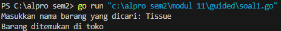
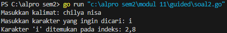
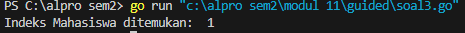
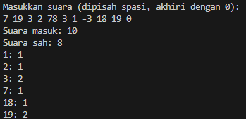
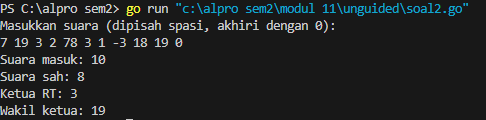
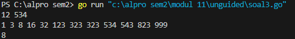

# <h1 align="center">Laporan Praktikum Modul 11<br> Pencarian Nilai Acak pada Himpunan Data</h1>
<p align="center">Chilya Fadhilatin Nisa - 103112430010</p>

## Dasar Teori

Pencarian secara sekuensial ini adalah pencarian yang dilakukan dari data pertama, kedua hingga terakhir secara satu persatu dan berurutan. Ciri khas dari pencarian ini adalah proses pencarian akan berhenti ketika data yang dicari ditemukan, walaupun masih terdapat data yang belum dicek nilainya. Algoritma ini dikenal dengan nama Sequential Search, karena prosesnya melakukan pengecekan setiap elemen array secara satu persatu dan sekuensial dari data pertama hingga ditemukan atau data terakhir.

---

## Guided

### Soal 1

```go
package main
import (

    "fmt"
    "strings"

)

  func cariBarang(barang []string, x string) bool {
    for _, b := range barang {
        if strings.ToLower(b) == strings.ToLower(x) {
            return true
        }

    }
    return false
}

func main() {
    barang := []string{"Sabun", "Shampoo", "Pasta Gigi", "Sikat Gigi", "Tissue"}

    var cari string
    fmt.Print("Masukkan nama barang yang dicari: ")
    fmt.Scanln(&cari)

    if cariBarang(barang, cari) {
        fmt.Println("Barang ditemukan di toko")
    } else {
        fmt.Println("Barang tidak ditemukan di toko")
    }

}

```

Output
> 

- **Import `fmt` & `strings`**:  
    Untuk input/output dan nyamain huruf besar-kecil (biar gak sensitif huruf).
- **Fungsi `cariBarang`**:  
    Cek apakah barang yang dicari user ada di list. Dibikin **tidak case-sensitive** pakai `strings.ToLower()`.
- **Fungsi `main`**:
    - Daftar barang disimpan di slice `barang`.
    - User disuruh input nama barang.
    - Panggil fungsi `cariBarang`.  
        Kalau ada ➜ cetak "Barang ditemukan",  
        kalau gak ➜ cetak "Barang tidak ditemukan".
### Soal 2

```go
package main

import (
    "bufio"
    "fmt"
    "os"
    "strings"
)

func printPositions(karakter string, posisi []int) {
    if len(posisi) > 0 {
        fmt.Printf("Karakter '%s' ditemukan pada indeks: %s\n", karakter, strings.Trim(strings.Join(strings.Fields(fmt.Sprint(posisi)), ","), "[]"))
    } else {
        fmt.Printf("Karakter '%s' tidak ditemukan dalam kalimat.\n", karakter)
    }
}

func main() {
    var karakter string
    reader := bufio.NewReader(os.Stdin)

    fmt.Print("Masukkan kalimat: ")
    kalimat, _ := reader.ReadString('\n')
    kalimat = strings.TrimSpace(kalimat)

    fmt.Print("Masukkan karakter yang ingin dicari: ")
    fmt.Scanln(&karakter)

    if len(karakter) != 1 {
        fmt.Println("Harap masukkan satu karakter saja.")
        return
    }

    var posisi []int
    for i, c := range kalimat {
        if string(c) == karakter {
            posisi = append(posisi, i)
        }
    }

    printPositions(karakter, posisi)
}
```

Output
> 

Program ini mencari indeks kemunculan karakter yang dimasukkan user dari sebuah kalimat, dan menampilkannya semua. Pakai slice untuk nyimpan posisi dan `range` buat loop tiap karakter
### Soal 3

```go
package main

import "fmt"
type Mahasiswa struct {
    NIM  string
    Nama string
}

func binarySearch(mahasiswa []Mahasiswa, target string) int {
    left := 0
    right := len(mahasiswa) - 1

    for left <= right {
        mid := left + (right-left)/2
        if mahasiswa[mid].NIM == target {
            return mid
        }

        if mahasiswa[mid].NIM > target {
            right = mid - 1
        } else {
            left = mid + 1
        }
    }

    return -1
}

func main() {
    mahasiswa := []Mahasiswa{
        {Nama: "Chil", NIM: "0002"},
        {Nama: "Syah", NIM: "0023"},
        {Nama: "Nay", NIM: "0045"},
        {Nama: "Bell", NIM: "0087"},
    }

    x := "0023"

    index := binarySearch(mahasiswa, x)

    if index != -1 {
        fmt.Println("Indeks Mahasiswa ditemukan: ",index)
    } else {
        fmt.Println("NIM tidak ditemukan.")
    }
}

```

Output
> 

Program ini melakukan pencarian cepat data mahasiswa berdasarkan NIM menggunakan **binary search**, dengan catatan data sudah **terurut**. Kalau cocok, ditampilkan indeksnya.

---
## Unguided

### Soal 1

Pada pemilihan ketua RT yang baru saja berlangsung, terdapat 20 calon ketua yang bertanding memperebutkan suara warga. Perhitungan suara dapat segera dilakukan karena warga cukup mengisi formulir dengan nomor dari calon ketua RT yang dipilihnya. Seperti biasa, selalu ada pengisian yang tidak tepat atau dengan nomor pilihan di luar yang tersedia, sehingga data juga harus divalidasi. Tugas Anda untuk membuat program mencari siapa yang memenangkan pemilihan ketua RT. 

```go
package main

import (
    "bufio"
    "fmt"
    "os"
    "strconv"
    "strings"
)

func main() {
    scanner := bufio.NewScanner(os.Stdin)
    fmt.Println("Masukkan suara (dipisah spasi, akhiri dengan 0):")
    scanner.Scan()
    input := scanner.Text()

    data := strings.Fields(input)

    suara := make([]int, 21)
    totalSuara := 0
    suaraSah := 0

    for _, str := range data {
        angka, err := strconv.Atoi(str)
        if err != nil {
            continue
        }

        if angka == 0 {
            break
        }

        totalSuara++

          if angka >= 1 && angka <= 20 {
            suara[angka]++
            suaraSah++
        }
    }

    fmt.Println("Suara masuk:", totalSuara)
    fmt.Println("Suara sah:", suaraSah)

    for i := 1; i <= 20; i++ {
        if suara[i] > 0 {
            fmt.Printf("%d: %d\n", i, suara[i])
        }
    }
}
```

> Output
> 

- **Input** dibaca menggunakan `bufio.Scanner` dalam satu baris dan dipisah berdasarkan spasi menggunakan `strings.Fields`.

- **Slice `suara` berukuran 21** dibuat untuk menyimpan jumlah suara dari nomor kandidat 1 sampai 20 (indeks 0 tidak dipakai).

- Dua variabel:
    - `totalSuara` untuk menghitung semua suara yang masuk (termasuk tidak sah),
    - `suaraSah` hanya untuk suara yang sah (1–20).

- Setiap angka:
    - Dikonversi dari string ke integer.
    - Jika angka **0**, maka input berhenti diproses.
    - Jika angka **1–20**, suara dianggap **sah** dan dihitung.
    - Di luar itu, dianggap **tidak sah**.

- Setelah itu, program mencetak:
    - Total suara masuk.
    - Total suara sah.
    - Jumlah suara masing-masing kandidat dari 1 sampai 20 (jika ada).
### Soal 2

Berdasarkan program sebelumnya, buat program pilkart yang mencari siapa pemenang pemilihan ketua RT. Sekaligus juga ditentukan bahwa wakil ketua RT adalah calon yang mendapatkan suara terbanyak kedua. Jika beberapa calon mendapatkan suara terbanyak yang sama, ketua terpilih adalah dengan nomor peserta yang paling kecil dan wakilnya dengan nomor peserta terkecil berikutnya.

```go
package main

import (
    "bufio"
    "fmt"
    "os"
    "sort"
    "strconv"
    "strings"
)

func main() {
    scanner := bufio.NewScanner(os.Stdin)
    fmt.Println("Masukkan suara (dipisah spasi, akhiri dengan 0):")
    scanner.Scan()
    input := scanner.Text()

    data := strings.Fields(input)

    suara := make([]int, 21)
    totalSuara := 0
    suaraSah := 0

    for _, str := range data {
        angka, err := strconv.Atoi(str)
        if err != nil {
            continue
        }

        if angka == 0 {
            break
        }

        totalSuara++

        if angka >= 1 && angka <= 20 {
            suara[angka]++
            suaraSah++
        }
    }

    fmt.Println("Suara masuk:", totalSuara)
    fmt.Println("Suara sah:", suaraSah)

    type calon struct {
        nomor int
        suara int
    }

    var daftarCalon []calon
    for i := 1; i <= 20; i++ {
        if suara[i] > 0 {
            daftarCalon = append(daftarCalon, calon{i, suara[i]})
        }
    }

    sort.Slice(daftarCalon, func(i, j int) bool {
        if daftarCalon[i].suara == daftarCalon[j].suara {
            return daftarCalon[i].nomor < daftarCalon[j].nomor
        }
        return daftarCalon[i].suara > daftarCalon[j].suara
    })

    if len(daftarCalon) >= 2 {
        fmt.Println("Ketua RT:", daftarCalon[0].nomor)
        fmt.Println("Wakil ketua:", daftarCalon[1].nomor)

    } else if len(daftarCalon) == 1 {
        fmt.Println("Ketua RT:", daftarCalon[0].nomor)
        fmt.Println("Wakil ketua: -")
    } else {
        fmt.Println("Tidak ada calon yang valid.")
    }
}
```

> Output
> 

1. **Input suara** dibaca satu baris (`scanner.Scan()`), lalu dipecah menjadi slice string dengan `strings.Fields()`.
    
2. Slice `suara` disiapkan berisi 21 elemen (index 0 tidak dipakai), untuk menyimpan jumlah suara masing-masing calon **(1-20)**.
    
3. Loop memproses setiap angka:
    - Jika angka **0**, maka berhenti membaca (tanda akhir input).
    - Semua angka dihitung sebagai **total suara masuk**.
    - Jika angka valid (1–20), masuk ke hitungan **suara sah**, dan dicatat ke array `suara`.

4. **Mencetak jumlah total suara** dan suara sah.
    
5. Struct `calon` dibuat untuk menyimpan `nomor` calon dan `suara` yang didapat.
    
6. Slice `daftarCalon` menyimpan calon-calon yang dapat suara (suara[i] > 0).
    
7. **Sorting**:
    - `sort.Slice()` mengurutkan `daftarCalon` berdasarkan suara terbanyak.
    - Jika suara sama, diurutkan berdasarkan **nomor calon terkecil**.
    
8. **Output akhir**:
    - Jika ada **2 calon atau lebih**, tampilkan ketua dan wakil.
    - Jika hanya **1 calon**, hanya ketua ditampilkan.
    - Jika **tidak ada suara sah**, tampilkan bahwa tidak ada calon yang valid.
### Soal 3

Diberikan n data integer positif dalam keadaan terurut membesar dan sebuah integer lain k, apakah bilangan k tersebut ada dalam daftar bilangan yang diberikan? Jika ya, berikan indeksnya, jika tidak sebutkan "TIDAK ADA".

```go
package main

import (
    "fmt"
)

const NMAX = 1000000
var data [NMAX]int

func main() {
    var n, k int
    fmt.Scan(&n, &k)
    isiArray(n)
    idx := posisi(n, k)

    if idx == -1 {
        fmt.Println("TIDAK ADA")
    } else {
        fmt.Println(idx)
    }
}

func isiArray(n int) {
    for i := 0; i < n; i++ {
        fmt.Scan(&data[i])
    }
}

func posisi(n, k int) int {
    left := 0
    right := n - 1

    for left <= right {
        mid := (left + right) / 2
        if data[mid] == k {
            return mid
        } else if data[mid] < k {
            left = mid + 1
        } else {
            right = mid - 1
        }
    }

    return -1
}
```

> Output
> 

- **Deklarasi Global:**
    - `NMAX` adalah jumlah maksimal elemen array (`1.000.000`).
    - `data` adalah array global yang akan menampung bilangan-bilangan.
    
- **Fungsi `main()`**
    - Membaca input `n` (jumlah data) dan `k` (nilai yang dicari).
    - Memanggil `isiArray(n)` untuk mengisi array `data` sebanyak `n` elemen.
    - Memanggil `posisi(n, k)` untuk mencari posisi `k` di dalam array menggunakan **binary search**.
    - Jika ditemukan, cetak indeksnya. Kalau tidak ditemukan, cetak `"TIDAK ADA"`.
    
- **Fungsi `isiArray(n)`**
    - Membaca `n` bilangan dan memasukkannya ke array `data`.
    
- **Fungsi `posisi(n, k)`**
    - Melakukan **binary search**:
        - Mulai dari indeks `left = 0` sampai `right = n - 1`.
        - Hitung titik tengah `mid`, lalu bandingkan nilai `data[mid]` dengan `k`.
        - Jika `data[mid] == k`, kembalikan `mid` (ketemu).
        - Jika lebih kecil, cari di sebelah kanan (`left = mid + 1`).
        - Jika lebih besar, cari di sebelah kiri (`right = mid - 1`).
    - Jika tidak ditemukan, return `-1`.