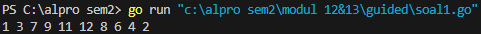
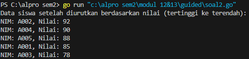
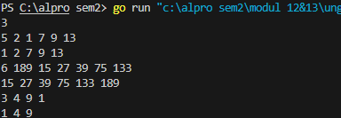
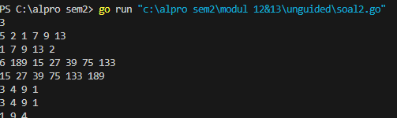
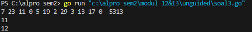
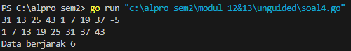
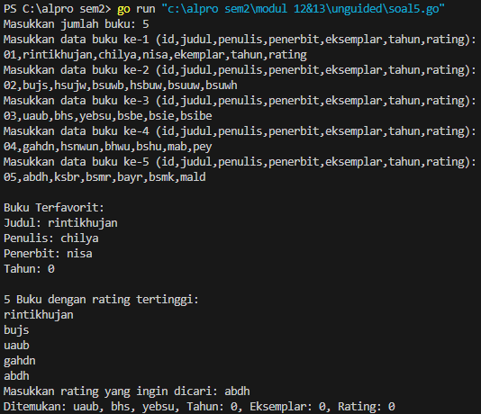

# <h1 align="center">Laporan Praktikum Modul 12&13<br> Pengurutan Data</h1>
<p align="center">Chilya Fadhilatin Nisa - 103112430010</p>

## Dasar Teori

Pengurutan secara seleksi ini idenya adalah mencari nilai ekstrim pada sekumpulan data, kemudian meletakkan pada posisi yang seharusnya. Pada penjelasan berikut ini data akan diurut membesar (ascending), dan data dengan indeks kecil ada di "kiri" dan indeks besar ada di "kanan".

---

## Guided

### Soal 1

Diberikan `n` bilangan bulat positif. Buat program untuk mengurutkan angka ganjil secara **membesar (ascending)** dan angka genap secara **mengecil (descending)**, lalu gabungkan hasilnya dengan ganjil duluan.

```go
package main

import "fmt"

func selectionSortAsc(arr []int, panjang int) {
	var temp, i, j, idxMin int
	for i = 0; i < panjang-1; i++ {
		idxMin = i
		for j = i + 1; j < panjang; j++ {
			if arr[j] < arr[idxMin] {
				idxMin = j
			}
		}
		temp = arr[idxMin]
		arr[idxMin] = arr[i]
		arr[i] = temp
	}
}

func selectionSortDesc(arr []int, panjang int) {
	var temp, i, j, idxMax int
	for i = 0; i < panjang-1; i++ {
		idxMax = i
		for j = i + 1; j < panjang; j++ {
			if arr[j] > arr[idxMax] {
				idxMax = j
			}
		}
		temp = arr[idxMax]
		arr[idxMax] = arr[i]
		arr[i] = temp
	}
}

func main() {
	n := 10
	numbers := []int{12, 7, 3, 2, 9, 6, 8, 1, 11, 4}

	var ganjil []int
	var genap []int

	for i := 0; i < n; i++ {
		if numbers[i]%2 == 1 {
			ganjil = append(ganjil, numbers[i])
		} else {
			genap = append(genap, numbers[i])
		}
	}

	selectionSortAsc(ganjil, len(ganjil))
	selectionSortDesc(genap, len(genap))

	for i := 0; i < len(ganjil); i++ {
		fmt.Print(ganjil[i], " ")
	}
	for i := 0; i < len(genap); i++ {
		fmt.Print(genap[i], " ")
	}
}


```

Output
> 

- Program ini **memisahkan angka ganjil dan genap** dari array `numbers`.
    
- Angka **ganjil diurutkan naik** (ascending) pakai **selection sort**.
    
- Angka **genap diurutkan turun** (descending) juga pakai **selection sort**.
    
- Setelah itu, **angka ganjil dicetak duluan**, baru diikuti angka genap.
### Soal 2

Sebuah kelas memiliki sejumlah siswa yang telah mengikuti ujian. Tugas Anda adalah membuat program yang membaca nilai-nilai ujian siswa dengan struct berisikan `nim` dan `nilai`, lalu mengurutkannya dari yang tertinggi ke yang terendah menggunakan **insertion sort**.

```go
package main

import "fmt"

type Siswa struct {
	NIM   string
	Nilai int
}

func insertionSort(data []Siswa) {
	for i := 1; i < len(data); i++ {
		key := data[i]
		j := i - 1

		for j >= 0 && data[j].Nilai < key.Nilai {
			data[j+1] = data[j]
			j--
		}
		data[j+1] = key
	}
}

func main() {
	siswa := []Siswa{
		{"A001", 85},
		{"A002", 92},
		{"A003", 78},
		{"A004", 90},
		{"A005", 88},
	}

	insertionSort(siswa)

	fmt.Println("Data siswa setelah diurutkan berdasarkan nilai (tertinggi ke terendah):")
	for _, s := range siswa {
		fmt.Printf("NIM: %s, Nilai: %d\n", s.NIM, s.Nilai)
	}
}

```

Output
> 

- Struct `Siswa` menyimpan data NIM dan nilai.
    
- Fungsi `insertionSort()` dipakai untuk **mengurutkan siswa berdasarkan nilai secara menurun (descending)**.
    
- Di `main`, data siswa dimasukkan, lalu diurutkan, dan ditampilkan satu per satu.

---
## Unguided

## Soal Latihan Selection Sort

### Soal 1

Hercules, preman terkenal seantero ibukota, memiliki kerabat di banyak daerah. Tentunya Hercules sangat suka mengunjungi semua kerabatnya itu. Diberikan masukan nomor rumah dari semua kerabatnya di suatu daerah, buatlah program rumahkerabat yang akan menyusun nomor-nomor rumah kerabatnya secara terurut membesar menggunakan algoritma selection sort.

```go
package main

import (
	"fmt"
)

func selectionSort(arr []int) {
	n := len(arr)
	for i := 0; i < n-1; i++ {
		minIdx := i
		for j := i + 1; j < n; j++ {
			if arr[j] < arr[minIdx] {
				minIdx = j
			}
		}
		arr[i], arr[minIdx] = arr[minIdx], arr[i]
	}
}

func main() {
	var n int
	fmt.Scan(&n) 

	for i := 0; i < n; i++ {
		var m int
		fmt.Scan(&m) 
		rumah := make([]int, m)

		for j := 0; j < m; j++ {
			fmt.Scan(&rumah[j])
		}

		selectionSort(rumah)

		for j := 0; j < m; j++ {
			fmt.Printf("%d ", rumah[j])
		}
		fmt.Println()
	}
}

```

> Output
> 

- Program membaca jumlah **daerah `n`** tempat kerabat Hercules tinggal.

- Untuk setiap daerah:
    - Membaca jumlah rumah `m`.
    - Menyimpan nomor rumah dalam array.
    - Mengurutkan array dengan **selection sort** (cari angka terkecil, tukar ke depan).
    - Mencetak hasil urutan nomor rumah di daerah tersebut.

- Output adalah daftar rumah yang sudah **terurut membesar** di setiap daerah, dipisahkan per baris.
### Soal 2

Belakangan diketahui ternyata Hercules itu tidak berani menyeberang jalan, maka selalu diusahakan agar hanya menyeberang jalan sesedikit mungkin, hanya diujung jalan. Karena nomor rumah sisi kiri jalan selalu ganjil dan sisi kanan jalan selalu genap, maka buatlah program kerabat dekat yang akan menampilkan nomor rumah mulai dari nomor yang ganjil lebih dulu terurut membesar dan kemudian menampilkan nomor rumah dengan nomor genap terurut mengecil.

```go
package main

import (
	"fmt"
	"sort"
)

func main() {
	var n int
	fmt.Scan(&n)

	for i := 0; i < n; i++ {
		var m int
		fmt.Scan(&m)

		numbers := make([]int, m)
		for j := 0; j < m; j++ {
			fmt.Scan(&numbers[j])
		}

		var ganjil []int
		var genap []int

		for _, num := range numbers {
			if num%2 == 1 {
				ganjil = append(ganjil, num)
			} else {
				genap = append(genap, num)
			}
		}

		sort.Ints(ganjil) 
		sort.Sort(sort.Reverse(sort.IntSlice(genap))) 

		for _, g := range ganjil {
			fmt.Print(g, " ")
		}
		for _, e := range genap {
			fmt.Print(e, " ")
		}
		fmt.Println()
	}
}
```

> Output
> 

- Program menerima input jumlah daerah `n`.
    
- Untuk tiap daerah:
    - Baca jumlah rumah `m`, lalu baca `m` nomor rumah.
    - Pisahkan nomor rumah ganjil dan genap ke array yang berbeda.
    - Urutkan:
        - Ganjil diurutkan **naik** (ascending).
        - Genap diurutkan **turun** (descending).
    - Cetak ganjil dulu, lalu genap.
### Soal 3

Kompetisi pemrograman yang baru saja berlalu diikuti oleh 17 tim dari berbagai perguruan tinggi ternama. Dalam kompetisi tersebut, setiap tim berlomba untuk menyelesaikan sebanyak mungkin problem yang diberikan. Dari 13 problem yang diberikan, ada satu problem yang menarik. Problem tersebut mudah dipahami, hampir semua tim mencoba untuk menyelesaikannya, tetapi hanya 3 tim yang berhasil. Apa sih problemnya? Buatlah program median yang mencetak nilai median terhadap seluruh data yang sudah terbaca, jika data yang dibaca saat itu adalah 0.

```go
package main

import (
	"bufio"
	"fmt"
	"os"
	"strconv"
	"strings"
)

func insertionSort(arr []int) {
	for i := 1; i < len(arr); i++ {
		key := arr[i]
		j := i - 1
		for j >= 0 && arr[j] > key {
			arr[j+1] = arr[j]
			j--
		}
		arr[j+1] = key
	}
}

func cariMedian(data []int) int {
	n := len(data)
	if n%2 == 1 {
		return data[n/2]
	}
	return (data[n/2-1] + data[n/2]) / 2 
}

func main() {
	scanner := bufio.NewScanner(os.Stdin)
	scanner.Split(bufio.ScanWords)

	var data []int

	for scanner.Scan() {
		input := scanner.Text()
		num, err := strconv.Atoi(strings.TrimSpace(input))
		if err != nil {
			continue
		}

		if num == -5313 {
			break
		} else if num == 0 {
			if len(data) == 0 {
				fmt.Println("Belum ada data.")
				continue
			}
			temp := make([]int, len(data))
			copy(temp, data)
			insertionSort(temp)
			median := cariMedian(temp)
			fmt.Println(median)
		} else {
			data = append(data, num)
		}
	}
}

```

> Output
> 

-  **Input dibaca satu per satu** menggunakan `bufio.Scanner` agar efisien.

- Setiap angka disimpan dalam array `data`, **kecuali angka `0` dan `-5313`.**

-  Jika ketemu angka `0`, maka:
    - Salin array `data` ke array baru (`temp`), supaya data asli tidak rusak.
    - Urutkan `temp` dengan **insertion sort**.
    - Hitung **median** dari data terurut tersebut dan cetak.

- Jika ketemu `-5313`, program berhenti.

## Soal Latihan Insertion Sort

### Soal 1

Buatlah sebuah program yang digunakan untuk membaca data integer seperti contoh yang diberikan di bawah ini, kemudian diurutkan (menggunakan metoda insertion sort), dan memeriksa apakah data yang terurut berjarak sama terhadap data sebelumnya.

```go
package main

import (
	"bufio"
	"fmt"
	"os"
	"strconv"
)

func insertionSort(arr []int) {
	for i := 1; i < len(arr); i++ {
		key := arr[i]
		j := i - 1
		for j >= 0 && arr[j] > key {
			arr[j+1] = arr[j]
			j--
		}
		arr[j+1] = key
	}
}

func cekJarak(arr []int) (bool, int) {
	if len(arr) < 2 {
		return true, 0
	}
	jarak := arr[1] - arr[0]
	for i := 1; i < len(arr)-1; i++ {
		if arr[i+1]-arr[i] != jarak {
			return false, 0
		}
	}
	return true, jarak
}

func main() {
	scanner := bufio.NewScanner(os.Stdin)
	scanner.Split(bufio.ScanWords)

	var data []int

	for scanner.Scan() {
		input := scanner.Text()
		num, err := strconv.Atoi(input)
		if err != nil {
			continue
		}
		if num < 0 {
			break
		}
		data = append(data, num)
	}

	insertionSort(data)

	for _, val := range data {
		fmt.Print(val, " ")
	}
	fmt.Println()

	ok, jarak := cekJarak(data)
	if ok {
		fmt.Printf("Data berjarak %d\n", jarak)
	} else {
		fmt.Println("Data berjarak tidak tetap")
	}
}

```

> Output
> 

- Input dibaca menggunakan `bufio.Scanner` supaya cepat.

- Hanya bilangan **non-negatif** yang masuk ke dalam array `data`.

- Array diurutkan pakai **insertion sort** manual (sesuai soal).

- Fungsi `cekJarak()`:
    - Menghitung selisih (`jarak`) antar dua bilangan pertama.
    - Mengecek apakah selisih semua elemen selanjutnya juga sama.

- Output:
    - Baris 1: isi array setelah diurutkan.
    - Baris 2: status jarak antar data.
### Soal 2

Sebuah program perpustakaan digunakan untuk mengelola data buku di dalam suatu perpustakaan. Masukan terdiri dari beberapa baris. Baris pertama adalah bilangan bulat N yang menyatakan banyaknya data buku yang ada di dalam perpustakaan. N baris berikutnya, masing-masingnya adalah data buku sesuai dengan atribut atau field pada struct. Baris terakhir adalah bilangan bulat yang menyatakan rating buku yang akan dicari. Keluaran terdiri dari beberapa baris. Baris pertama adalah data buku terfavorit, baris kedua adalah lima judul buku dengan rating tertinggi, selanjutnya baris terakhir adalah data buku yang dicari sesuai rating yang diberikan pada masukan baris terakhir.

```go
package main

import (
	"bufio"
	"fmt"
	"os"
	"strconv"
	"strings"
)

type Buku struct {
	id        string
	judul     string
	penulis   string
	penerbit  string
	eksemplar int
	tahun     int
	rating    int
}

func inputBuku(scanner *bufio.Scanner, n int) []Buku {
	var pustaka []Buku
	for i := 0; i < n; i++ {
		fmt.Printf("Masukkan data buku ke-%d (id,judul,penulis,penerbit,eksemplar,tahun,rating):\n", i+1)
		scanner.Scan()
		data := strings.Split(scanner.Text(), ",")
		eksemplar, _ := strconv.Atoi(data[4])
		tahun, _ := strconv.Atoi(data[5])
		rating, _ := strconv.Atoi(data[6])
		buku := Buku{
			id:        data[0],
			judul:     data[1],
			penulis:   data[2],
			penerbit:  data[3],
			eksemplar: eksemplar,
			tahun:     tahun,
			rating:    rating,
		}
		pustaka = append(pustaka, buku)
	}
	return pustaka
}

func cariTerfavorit(pustaka []Buku) Buku {
	terfavorit := pustaka[0]
	for _, buku := range pustaka {
		if buku.rating > terfavorit.rating {
			terfavorit = buku
		}
	}
	return terfavorit
}

func urutRating(pustaka []Buku) {
	for i := 1; i < len(pustaka); i++ {
		key := pustaka[i]
		j := i - 1
		for j >= 0 && pustaka[j].rating < key.rating {
			pustaka[j+1] = pustaka[j]
			j--
		}
		pustaka[j+1] = key
	}
}

func cetak5Buku(pustaka []Buku) {
	fmt.Println("5 Buku dengan rating tertinggi:")
	jumlah := 5
	if len(pustaka) < 5 {
		jumlah = len(pustaka)
	}
	for i := 0; i < jumlah; i++ {
		fmt.Println(pustaka[i].judul)
	}
}

func cariBukuDenganRating(pustaka []Buku, r int) {
	kiri := 0
	hapus := len(pustaka) - 1
	for kiri <= hapus {
		tengah := (kiri + hapus) / 2
		if pustaka[tengah].rating == r {
			b := pustaka[tengah]
			fmt.Printf("Ditemukan: %s, %s, %s, Tahun: %d, Eksemplar: %d, Rating: %d\n",
				b.judul, b.penulis, b.penerbit, b.tahun, b.eksemplar, b.rating)
			return
		} else if pustaka[tengah].rating < r {
			hapus = tengah - 1
		} else {
			kiri = tengah + 1
		}
	}
	fmt.Println("Tidak ada buku dengan rating tersebut.")
}

func main() {
	scanner := bufio.NewScanner(os.Stdin)
	fmt.Print("Masukkan jumlah buku: ")
	scanner.Scan()
	n, _ := strconv.Atoi(scanner.Text())

	pustaka := inputBuku(scanner, n)

	fav := cariTerfavorit(pustaka)
	fmt.Printf("\nBuku Terfavorit:\nJudul: %s\nPenulis: %s\nPenerbit: %s\nTahun: %d\n\n", fav.judul, fav.penulis, fav.penerbit, fav.tahun)

	urutRating(pustaka)
	cetak5Buku(pustaka)

	fmt.Print("Masukkan rating yang ingin dicari: ")
	scanner.Scan()
	rating, _ := strconv.Atoi(scanner.Text())
	cariBukuDenganRating(pustaka, rating)
}
```

> Output
> 

- **Struct Buku** — Menyimpan informasi setiap buku seperti ID, judul, penulis, penerbit, eksemplar, tahun, dan rating.
    
- **inputBuku** — Membaca data buku dari input.
    
- **cariTerfavorit** — Menemukan buku dengan rating tertinggi.
    
- **urutRating** — Mengurutkan buku berdasarkan rating tertinggi ke terendah menggunakan insertion sort.
    
- **cetak5Buku** — Menampilkan 5 buku dengan rating tertinggi.
    
- **cariBukuDenganRating** — Mencari buku dengan rating tertentu menggunakan binary search.
    
- **main** — Fungsi utama untuk mengontrol alur program.