<h1 align="center">Laporan Praktikum Modul 2 <br>Review Pengenalan Pemrograman</h1>
<p align="center">Chilya Fadhilatin Nisa - 103112430010</p>

## Dasar Teori
Golang (Go) adalah bahasa pemrograman open-source dari Google yang cepat, sederhana, dan efisien. Memiliki **tipe data statis**, **kompilasi langsung**, serta mendukung **concurrency** dengan **goroutine**. Struktur dasarnya terdiri dari **package, import, dan fungsi main**. Mendukung **array, slice, percabangan, perulangan**, serta fungsi dengan parameter & return value. Keunggulannya ada pada **kecepatan, efisiensi memori, dan concurrency**, sehingga cocok untuk **backend, cloud computing, dan sistem terdistribusi**. 
## Unguided

### Soal Latihan 2A

#### Soal 1

> Telusuri program berikut dengan cara mengkompilasi dan mengeksekusi program. Silakan masukan data yang sesuai sebanyak yang diminta program. Perhatikan keluaran yang diperoleh. Coba terangkan apa sebenarnya yang dilakukan program tersebut?

```go
package main

import "fmt"

func main() {

    var (
        satu, dua, tiga string
        temp            string
    )

    fmt.Print("Masukan input string: ")
    fmt.Scanln(&satu)

    fmt.Print("Masukan input string: ")
    fmt.Scanln(&dua)

    fmt.Print("Masukan input string: ")
    fmt.Scanln(&tiga)

    fmt.Println("Output awal = " + satu + " " + dua + " " + tiga)

    temp = satu
    satu = dua
    dua = tiga
    tiga = temp

    fmt.Println("Output akhir = " + satu + " " + dua + " " + tiga)

}
```

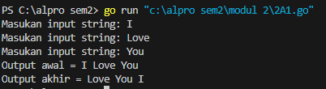

Program ini meminta pengguna untuk memasukkan tiga string secara berurutan. Setelah itu, program mencetak susunan awal dari ketiga string tersebut. Kemudian, dilakukan pertukaran posisi string menggunakan variabel sementara, di mana string pertama dipindahkan ke posisi kedua, string kedua ke posisi ketiga, dan string ketiga ke posisi pertama. Setelah proses pertukaran selesai, program mencetak susunan string yang telah berubah.

#### Soal 2

>Tahun kabisat adalah tahun yang habis dibagi 400 atau habis dibagi 4 tetapi tidak habis dibagi 100. Buatlah sebuah program yang menerima input sebuah bilangan bulat dan memeriksa apakah bilangan tersebut merupakan tahun kabisat (true) atau bukan (false).

```go
package main
import "fmt"

func cekKabisat(tahun int) bool {

    if (tahun%4 == 0 && tahun%100 != 0) || (tahun%400 == 0) {

        return true

    }

    return false

}

  

func main() {

    var tahun int

    fmt.Print("Masukkan tahun: ")

    fmt.Scanln(&tahun)

  

    kabisat := cekKabisat(tahun)

  

    fmt.Println("Tahun:", tahun)

    fmt.Println("Kabisat:", kabisat)

}
```

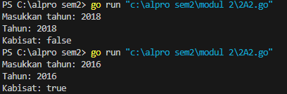

Program ini meminta pengguna memasukkan sebuah tahun, lalu mengecek apakah tahun tersebut merupakan tahun kabisat atau tidak. Pengecekan dilakukan dengan aturan bahwa tahun kabisat adalah tahun yang habis dibagi 4 tetapi tidak habis dibagi 100, kecuali jika tahun tersebut juga habis dibagi 400. Hasil pengecekan kemudian ditampilkan di layar.

#### Soal 3

>Buat program Bola yang menerima input jari-jari suatu bola (bilangan bulat). Tampilkan Volume dan Luas kulit bola. 𝑣𝑜𝑙𝑢𝑚𝑒𝑏𝑜𝑙𝑎 = 4 3 𝜋𝑟 3 dan 𝑙𝑢𝑎𝑠𝑏𝑜𝑙𝑎 = 4𝜋𝑟 2 (π ≈ 3.1415926535).

```go
package main

  

import "fmt"

  

func main() {

    var r float64

    const pi = 3.1415926535

  

    fmt.Print("Masukkan jari-jari bola: ")

    fmt.Scanln(&r)

  

    volume := (4.0 / 3.0) * pi * (r * r * r)

    luas := 4 * pi * (r * r)

  

    fmt.Printf("Bola dengan jejarai %.0f memiliki volume %.4f dan luas kulit %.4f\n", r, volume, luas)

}
```


Program ini meminta pengguna untuk memasukkan jari-jari sebuah bola, lalu menghitung dan menampilkan volume serta luas permukaannya. Nilai **π (pi)** digunakan sebagai konstanta dalam perhitungan. Volume bola dihitung dengan rumus **(4/3) × π × r³**, sedangkan luas permukaannya dihitung dengan rumus **4 × π × r²**. Hasil perhitungan kemudian ditampilkan dalam format yang rapi.

#### Soal 4

>Dibaca nilai temperatur dalam derajat Celsius. Nyatakan temperatur tersebut dalam Fahrenheit 𝐶𝑒𝑙𝑠𝑖𝑢𝑠 = (𝐹𝑎ℎ𝑟𝑒𝑛ℎ𝑒𝑖𝑡 − 32) × 5/9 𝑅𝑒𝑎𝑚𝑢𝑟 = 𝐶𝑒𝑙𝑐𝑖𝑢𝑠 × 4/5 𝐾𝑒𝑙𝑣𝑖𝑛 = (𝐹𝑎ℎ𝑟𝑒𝑛ℎ𝑒𝑖𝑡 + 459.67) × 5/9

```go
package main

  

import "fmt"

  

func main() {

    var celsius float64

  

    fmt.Print("Masukkan suhu dalam Celsius: ")

    fmt.Scanln(&celsius)

  

    reamur := celsius * 4 / 5

    fahrenheit := (celsius * 9 / 5) + 32

    kelvin := celsius + 273.15

  

    fmt.Println("Temperatur Celsius:", celsius)

    fmt.Println("Derajat Reamur:", reamur)

    fmt.Println("Derajat Fahrenheit:", fahrenheit)

    fmt.Println("Derajat Kelvin:", kelvin)

}
```

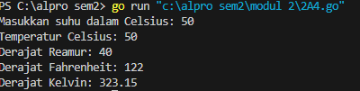

Program ini meminta pengguna memasukkan suhu dalam derajat Celsius, lalu mengonversinya ke tiga satuan suhu lainnya, yaitu Reamur, Fahrenheit, dan Kelvin. Konversi dilakukan dengan rumus **Reamur = Celsius × 4/5**, **Fahrenheit = (Celsius × 9/5) + 32**, dan **Kelvin = Celsius + 273.15**. Setelah perhitungan selesai, program menampilkan hasil konversi dalam masing-masing satuan suhu.

#### Soal 5

>Tipe karakter sebenarnya hanya apa yang tampak dalam tampilan. Di dalamnya tersimpan dalam bentuk biner 8 bit (byte) atau 32 bit (rune) saja. Buat program ASCII yang akan membaca 5 buat data integer dan mencetaknya dalam format karakter. Kemudian membaca 3 buah data karakter dan mencetak 3 buah karakter setelah karakter tersebut (menurut tabel ASCII) Masukan terdiri dari dua baris. Baris pertama berisi 5 buah data integer. Data integer mempunyai nilai antara 32 s.d. 127. Baris kedua berisi 3 buah karakter yang berdampingan satu dengan yang lain (tanpa dipisahkan spasi). Keluaran juga terdiri dari dua baris. Baris pertama berisi 5 buah representasi karakter dari data yang diberikan, yang berdampingan satu dengan lain, tanpa dipisahkan spasi. Baris kedua berisi 3 buah karakter (juga tidak dipisahkan oleh spasi).

```go
package main

  

import "fmt"

  

func main() {

  

    var kode1, kode2, kode3, kode4, kode5 int

    var huruf1, huruf2, huruf3 rune

  

    fmt.Scan(&kode1, &kode2, &kode3, &kode4, &kode5)

    fmt.Scanln()

    fmt.Scanf("%c%c%c\n", &huruf1, &huruf2, &huruf3)

  

    huruf1 += 1

    huruf2 += 1

    huruf3 += 1

  

    fmt.Printf("%c%c%c%c%c\n", kode1, kode2, kode3, kode4, kode5)

    fmt.Printf("%c%c%c\n", huruf1, huruf2, huruf3)

}
```

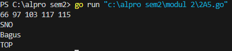

Program ini membaca lima angka dan tiga karakter dari input pengguna. Setelah itu, setiap karakter ditambahkan dengan nilai 1 dalam kode ASCII, sehingga karakter berubah ke huruf berikutnya dalam urutan alfabet. Kemudian, program mencetak lima angka dalam bentuk karakter ASCII dan mencetak tiga karakter yang telah diubah. 

### Soal Latihan 2B

#### Soal 1

> Siswa kelas IPA di salah satu sekolah menengah atas di Indonesia sedang mengadakan praktikum kimia. Di setiap percobaan akan menggunakan 4 tabung reaksi, yang mana susunan warna cairan di setiap tabung akan menentukan hasil percobaan. Siswa diminta untuk mencatat hasil percobaan tersebut. Percobaan dikatakan berhasil apabila susunan warna zat cair pada gelas 1 hingga gelas 4 secara berturutan adalah ‘merah’, ‘kuning’, ‘hijau’, dan ‘ungu’ selama 5 kali percobaan berulang. Buatlah sebuah program yang menerima input berupa warna dari ke 4 gelas reaksi sebanyak 5 kali percobaan. Kemudian program akan menampilkan true apabila urutan warna sesuai dengan informasi yang diberikan pada paragraf sebelumnya, dan false untuk urutan warna lainnya.

```go
package main

  

import "fmt"

  

func main() {

    const jumlahPercobaan = 5

    var percobaan [jumlahPercobaan][4]string

    urutanBenar := [4]string{"merah", "kuning", "hijau", "ungu"}

    berhasil := true

  

    for i := 0; i < jumlahPercobaan; i++ {

        fmt.Printf("Percobaan %d: ", i+1)

        fmt.Scan(&percobaan[i][0], &percobaan[i][1], &percobaan[i][2], &percobaan[i][3])

  

        for j := 0; j < 4; j++ {

            if percobaan[i][j] != urutanBenar[j] {

                berhasil = false

            }

        }

    }

  

    fmt.Println("BERHASIL:", berhasil)

}
```

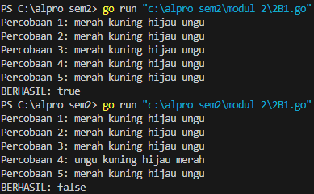

Program ini meminta pengguna untuk memasukkan empat warna sebanyak lima kali percobaan. Setiap percobaan dibandingkan dengan urutan warna yang benar, yaitu **merah, kuning, hijau, ungu**. Jika ada warna yang tidak sesuai, variabel **berhasil** diubah menjadi **false**. Setelah lima percobaan selesai, program menampilkan apakah semua percobaan berhasil atau tidak berdasarkan kesesuaian warna yang dimasukkan.

#### Soal 2

> Suatu pita (string) berisi kumpulan nama-nama bunga yang dipisahkan oleh spasi dan ‘– ‘, contoh pita diilustrasikan seperti berikut ini. Pita: mawar – melati – tulip – teratai – kamboja – anggrek Buatlah sebuah program yang menerima input sebuah bilangan bulat positif (dan tidak nol) N, kemudian program akan meminta input berupa nama bunga secara berulang sebanyak N kali dan nama tersebut disimpan ke dalam pita. (Petunjuk: gunakan operasi penggabungan string dengan operator “+” ). Tampilkan isi pita setelah proses input selesai.

```go
package main

  

import "fmt"

  

func main() {

  

    var bunga, pita string

    var jumlah int

  

    jumlah = 0

  

    for {

  

        fmt.Print("Bunga ", jumlah+1, ": ")

        fmt.Scan(&bunga)

  

        if bunga == "selesai" {

            break

        }

  

        pita = pita + bunga + " - "

        jumlah++

  

    }

  

    fmt.Println("Pita:", pita)

    fmt.Println("Bunga:", jumlah)

  

}
```

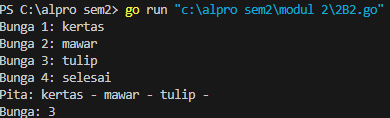

Program ini meminta pengguna untuk memasukkan nama bunga satu per satu. Setiap bunga yang dimasukkan akan ditambahkan ke dalam sebuah string dengan format **"nama_bunga - "**. Proses ini terus berulang hingga pengguna memasukkan kata **"selesai"**, yang akan menghentikan input. Setelah itu, program mencetak daftar bunga yang telah dimasukkan dalam bentuk rangkaian teks serta jumlah total bunga yang dimasukkan.

#### Soal 3

> Setiap hari Pak Andi membawa banyak barang belanjaan dari pasar dengan mengendarai sepeda motor. Barang belanjaan tersebut dibawa dalam kantong terpal di kiri-kanan motor. Sepeda motor tidak akan oleng jika selisih berat barang di kedua kantong sisi tidak lebih dari 9 kg. Buatlah program Pak Andi yang menerima input dua buah bilangan real positif yang menyatakan berat total masing-masing isi kantong terpal. Program akan terus meminta input bilangan tersebut hingga salah satu kantong terpal berisi 9 kg atau lebih.

```go
package main

  

import "fmt"

  

func main() {

  

    var kantong1, kantong2, selisih float32

    var oleng bool

  

    for {

        fmt.Print("Masukan berat belanjaan di kedua kantong: ")

        fmt.Scan(&kantong1, &kantong2)

  

        if kantong1 < 0 || kantong2 < 0 {

            fmt.Println("Proses selesai")

            break

        }

  

        if kantong1+kantong2 > 150 {

            fmt.Println("Proses selesai")

            break

        }

  

        if kantong1 > kantong2 {

            selisih = kantong1 - kantong2

        } else {

            selisih = kantong2 - kantong1

        }

  

        oleng = selisih >= 9

        fmt.Println("Sepeda motor pak Andi akan oleng:", oleng)

    }

  

}
```

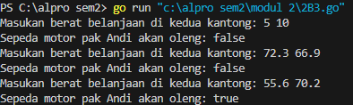

Program ini meminta pengguna untuk memasukkan berat belanjaan di dua kantong. Jika salah satu berat yang dimasukkan bernilai negatif atau total berat kedua kantong melebihi 150, program akan berhenti. Jika tidak, program menghitung selisih berat antara kedua kantong. Jika selisihnya **9 atau lebih**, program mencetak bahwa **sepeda motor Pak Andi akan oleng**. Proses ini terus berulang hingga kondisi berhenti terpenuhi.

#### Soal 4
> Diberikan sebuah persamaan sebagai berikut ini. 𝑓(𝑘) = (4𝑘 + 2) 2 (4𝑘 + 1)(4𝑘 + 3) Buatlah sebuah program yang menerima input sebuah bilangan sebagai K, kemudian menghitung dan menampilkan nilai f(K) sesuai persamaan di atas.

```go
package main

  

import (

    "fmt"

    "math"

)

  

func main() {

    var k int

  

    fmt.Print("Nilai K: ")

    fmt.Scan(&k)

  

    result := 1.0

  

    for i := 0; i < k; i++ {

        numerator := math.Pow(float64(4*i+2), 2)

        denumerator := float64((4*i + 1) * (4*i + 3))

        result *= numerator / denumerator

    }

  

    fmt.Printf("Hasil dari operasi fungsi = %.10f\n", result)

}
```

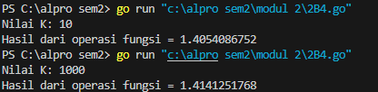

Program ini meminta pengguna memasukkan nilai **K** dan kemudian menghitung hasil operasi matematika menggunakan perulangan sebanyak **K kali**. Dalam setiap iterasi, program menghitung **pembilang (numerator)** dengan rumus **(4i + 2)²** dan **penyebut (denumerator)** dengan rumus **(4i + 1) * (4i + 3)**. Hasil bagi dari pembilang dan penyebut dikalikan dengan hasil sebelumnya. Setelah perulangan selesai, program mencetak hasil akhir dengan **presisi 10 desimal**.
### Soal Latihan 2C

#### Soal 1

> PT POS membutuhkan aplikasi perhitungan biaya kirim berdasarkan berat parsel. Maka, buatlah program BiayaPos untuk menghitung biaya pengiriman tersebut dengan ketentuan sebagai berikut! Dari berat parsel (dalam gram), harus dihitung total berat dalam kg dan sisanya (dalam gram). Biaya jasa pengiriman adalah Rp. 10.000,- per kg. Jika sisa berat tidak kurang dari 500 gram, maka tambahan biaya kirim hanya Rp. 5,- per gram saja. Tetapi jika kurang dari 500 gram, maka tambahan biaya akan dibebankan sebesar Rp. 15,- per gram. Sisa berat (yang kurang dari 1kg) digratiskan biayanya apabila total berat ternyata lebih dari 10kg.

```go
package main

  

import "fmt"

  

func main() {

  

    var berat, kg, gram, harga int

  

    fmt.Print("Berat parsel (gram): ")

    fmt.Scanln(&berat)

  

    kg = berat / 1000

    gram = berat % 1000

  

    fmt.Println("Detail berat:", kg, "kg", "+", gram, "gram")

  

    if gram >= 500 {

        gram = gram * 5

    } else {

        gram = gram * 15

    }

  

    if kg < 10 {

        kg = kg * 10000

        harga = kg + gram

    } else {

        kg = kg * 10000

        harga = kg

    }

  

    fmt.Println("Detail biaya: Rp", kg, "+ Rp", gram)

    fmt.Println("Total biaya: Rp", harga)

  

}
```

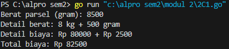

Program ini meminta pengguna memasukkan berat parsel dalam gram, lalu menghitung dan menampilkan beratnya dalam satuan kilogram dan gram. Jika sisa gram lebih dari atau sama dengan 500, maka biaya per gram dikalikan 5, sedangkan jika kurang dari 500, dikalikan 15. Untuk biaya per kilogram, jika berat kurang dari 10 kg, maka setiap kilogram dihitung Rp10.000 dan ditambah biaya dari gram. Jika beratnya 10 kg atau lebih, maka hanya dihitung berdasarkan kilogram tanpa tambahan dari gram. Program kemudian menampilkan rincian biaya serta total biaya pengiriman.

#### Soal 2

> Jawablah pertanyaan-pertanyaan berikut: 
> a. Jika nam diberikan adalah 80.1, apa keluaran dari program tersebut? Apakah eksekusi program tersebut sesuai spesifikasi soal? 
> b. Apa saja kesalahan dari program tersebut? Mengapa demikian? Jelaskan alur program seharusnya! 
> c. Perbaiki program tersebut! Ujilah dengan masukan: 93.5; 70.6; dan 49.5. Seharusnya keluaran yang diperoleh adalah ‘A’, ‘B’, dan ‘D’.

##### Kode Awal
```go
package main  
import “fmt”  
func main() {  
var nam float64  
var nmk string  
fmt.Print(“Nilai akhir mata kuliah: “)  
fmt.Scanln(&nam)  
if nam > 80 {  
nam = “A”  
}  
if nam > 72.5 {  
nam = “AB”  
}  
if nam > 65 {  
nam = “B”  
}  
if nam > 57.5 {  
nam = “BC”  
}  
if nam > 50 {  
nam = “C”  
}  
if nam > 40 {  
nam = “D”  
} else if nam <= 40 {  
nam = “E”  
}  
fmt.Println(“Nilai mata kuliah: “, nmk)  
}
```

##### Kode Setelah Perbaikan
```go
package main

  

import "fmt"

  

func main() {

  

    var nam float64

    var nmk string

  

    fmt.Print("Nilai akhir mata kuliah: ")

    fmt.Scanln(&nam)

  

    if nam > 80 {

        nmk = "A"

    } else if nam > 72.5 && nam <= 80 {

        nmk = "AB"

    } else if nam > 65 && nam <= 72.5 {

        nmk = "B"

    } else if nam > 57.5 && nam <= 65 {

        nmk = "BC"

    } else if nam > 50 && nam <= 57.5 {

        nmk = "C"

    } else if nam > 40 && nam <= 50 {

        nmk = "D"

    } else if nam <= 40 {

        nmk = "E"

    }

  

    fmt.Println("Nilai mata kuliah:", nmk)

}
```

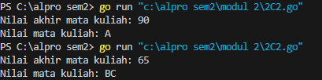

a. Jika nilai `nam` diberikan **80.1**, program akan masuk ke kondisi pertama (`if nam > 80`), sehingga nilai huruf yang dihasilkan adalah `"A"`. Eksekusi ini **sesuai dengan spesifikasi soal** karena nilai 80.1 memang lebih besar dari 80 dan harus mendapatkan nilai `"A"`.

b. Program memiliki dua kesalahan utama. Pertama, batasan interval tidak konsisten. Setelah pengecekan `if nam > 80`, terdapat kondisi `else if nam > 72.5 && nam <= 80`, yang menyebabkan nilai **80** masuk ke kategori `"AB"`, padahal seharusnya `"A"`. Hal ini membuat pembagian nilai menjadi tidak akurat.
Kedua, program tidak memiliki validasi untuk nilai di luar rentang **0 - 100**. Jika pengguna memasukkan angka negatif atau lebih dari 100, program tetap memberikan nilai huruf tanpa memastikan bahwa inputnya valid. Seharusnya, program memeriksa terlebih dahulu apakah nilai berada dalam rentang yang benar sebelum menentukan kategori nilai huruf.

c. Kode yang telah diperbaiki sekarang akan memberikan hasil yang benar dan menangani kasus nilai yang tidak valid.

#### Soal 3

> Sebuah bilangan bulat b memiliki faktor bilangan f > 0 jika f habis membagi b. Contoh: 2 merupakan faktor dari bilangan 6 karena 6 habis dibagi 2. Buatlah program yang menerima input sebuah bilangan bulat b dan b > 1. Program harus dapat mencari dan menampilkan semua faktor dari bilangan tersebut!
> Bilangan bulat b > 0 merupakan bilangan prima p jika dan hanya jika memiliki persis dua faktor bilangan saja, yaitu 1 dan dirinya sendiri. Lanjutkan program sebelumnya. Setelah menerima masukan sebuah bilangan bulat b > 0. Program tersebut mencari dan menampilkan semua faktor bilangan tersebut. Kemudian, program menentukan apakah b merupakan bilangan prima.

```go
package main

  

import "fmt"

  

func main() {

  

    var bilangan, faktor int

    var prima bool

  

    fmt.Print("Bilangan: ")

    fmt.Scan(&bilangan)

  

    fmt.Print("Faktor: ")

    for i := 1; i <= bilangan; i++ {

  

        if bilangan%i == 0 {

            fmt.Print(i, " ")

            faktor++

        }

  

    }

  

    fmt.Println()

  

    if faktor == 2 {

        prima = true

    } else {

        prima = false

    }

  

    fmt.Println("Prima:", prima)

}```

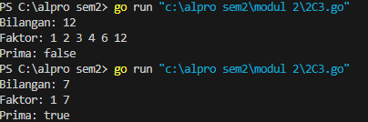

Program ini mengecek faktor dari sebuah bilangan dan menentukan apakah bilangan tersebut adalah bilangan prima atau tidak.

Pertama, program meminta pengguna memasukkan bilangan. Lalu, dengan menggunakan perulangan dari 1 hingga bilangan tersebut, program mencari dan mencetak faktor-faktor dari bilangan tersebut. Jika suatu angka dapat membagi bilangan tanpa sisa, maka angka tersebut dianggap sebagai faktor dan dihitung.

Setelah semua faktor ditemukan, program memeriksa apakah jumlah faktor yang ditemukan adalah **2** (hanya bisa dibagi oleh 1 dan dirinya sendiri). Jika iya, bilangan tersebut dianggap sebagai bilangan prima dan variabel `prima` diatur menjadi `true`, jika tidak maka diatur menjadi `false`. Hasil akhirnya akan mencetak apakah bilangan tersebut merupakan bilangan prima atau bukan.
