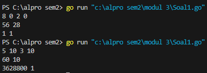
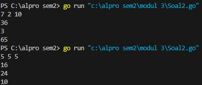

<h1 align="center">Laporan Praktikum Modul 3 <br>Fungsi</h1>
<p align="center">Chilya Fadhilatin Nisa - 103112430010</p>

## Dasar Teori
Fungsi dalam Golang adalah blok kode yang dapat digunakan kembali untuk menjalankan tugas tertentu. Fungsi bisa memiliki parameter atau tidak, serta bisa mengembalikan satu atau lebih nilai. Golang juga mendukung variadic function (parameter dinamis), fungsi sebagai parameter, dan anonymous function (fungsi tanpa nama). Dengan memahami fungsi, kode menjadi lebih modular, efisien, dan mudah dikelola. 
## Unguided

### Soal Latihan Modul 3

#### Soal 1

> Minggu ini, mahasiswa Fakultas Informatika mendapatkan tugas dari mata kuliah matematika  diskrit untuk mempelajari kombinasi dan permutasi. Jonas salah seorang mahasiswa, iseng  untuk mengimplementasikannya ke dalam suatu program. Oleh karena itu bersediakah kalian  membantu Jonas?

```go
package main
import (

    "fmt"
)

func factorial(n int) int {
    if n == 0 || n == 1 {
        return 1
    }
    result := 1
    for i := 2; i <= n; i++ {
        result *= i
    }
    return result
}

func permutation(n, r int) int {
    return factorial(n) / factorial(n-r)
}

func combination(n, r int) int {
    return factorial(n) / (factorial(r) * factorial(n-r))
}

func main() {
    var a, b, c, d int
    fmt.Scan(&a, &b, &c, &d)

    if a >= c && b >= d {
        fmt.Println(permutation(a, c), combination(a, c))
        fmt.Println(permutation(b, d), combination(b, d))

    } else {
        fmt.Println("Input tidak memenuhi syarat a >= c dan b >= d")
    }
}
```



Program ini ditulis dalam bahasa Golang untuk menghitung permutasi dan kombinasi dari dua pasang bilangan. Program ini menggunakan tiga fungsi utama:
1. `factorial(n)`, yang menghitung faktorial suatu bilangan.
2. `permutation(n, r)`, yang menghitung permutasi dengan rumus P(n,r)=n!/(n−r)!P(n, r) = n! / (n-r)!.
3. `combination(n, r)`, yang menghitung kombinasi dengan rumus C(n,r)=n!/(r!(n−r)!)C(n, r) = n! / (r!(n-r)!).
Program membaca empat bilangan sebagai input, kemudian menghitung permutasi dan kombinasi untuk masing-masing pasangan bilangan jika memenuhi syarat a≥ca \geq c dan b≥db \geq d. Jika syarat tidak terpenuhi, program menampilkan pesan bahwa input tidak memenuhi ketentuan.

#### Soal 2

>Diberikan tiga buah fungsi matematika yaitu 𝑓 (𝑥) = 𝑥# , 𝑔 (𝑥) = 𝑥 - 2 dan ℎ (𝑥) = 𝑥 + 1. Fungsi komposisi (𝑓𝑜𝑔𝑜ℎ)(𝑥) artinya adalah 𝑓(𝑔Gℎ(𝑥)H). Tuliskan 𝑓(𝑥), 𝑔(𝑥) dan ℎ(𝑥) dalam bentuk function.

```go
package main
import (

    "fmt"
)

func f(x int) int {
    return x * x
}

func g(x int) int {
    return x - 2
}

func h(x int) int {
    return x + 1
}

func fogoh(x int) int {
    return f(g(h(x)))
}

func gohof(x int) int {
    return g(h(f(x)))
}

func hofog(x int) int {
    return h(f(g(x)))
}

func main() {
    var a, b, c int
    fmt.Scan(&a, &b, &c)

    fmt.Println(fogoh(a))
    fmt.Println(gohof(b))
    fmt.Println(hofog(c))

}
```



Program ini menggunakan Golang untuk menghitung komposisi tiga fungsi matematika: kuadrat, pengurangan, dan penjumlahan. Fungsi kuadrat mengembalikan hasil bilangan yang dikalikan dengan dirinya sendiri, fungsi pengurangan mengurangi bilangan dengan dua, dan fungsi penjumlahan menambah bilangan dengan satu. Program memiliki tiga fungsi komposisi dengan urutan operasi yang berbeda. Setelah membaca tiga bilangan sebagai input, program menghitung hasilnya sesuai komposisi fungsi dan menampilkannya ke layar.

#### Soal 3

>Suatu lingkaran didefinisikan dengan koordinat titik pusat (𝑐𝑥, 𝑐𝑦) dengan radius 𝑟. Apabila diberikan dua buah lingkaran, maka tentukan posisi sebuah titik sembarang (𝑥, 𝑦) berdasarkan dua lingkaran tersebut.

```go
package main
import (

    "fmt"
    "math"
    
)

func jarak(a, b, c, d float64) float64 {
    return math.Sqrt(math.Pow(a-c, 2) + math.Pow(b-d, 2))
}

func didalam(cx, cy, r, x, y float64) bool {
    return jarak(cx, cy, x, y) <= r
}

func main() {
    var cx1, cy1, r1, cx2, cy2, r2, x, y float64
    fmt.Scan(&cx1, &cy1, &r1)
    fmt.Scan(&cx2, &cy2, &r2)
    fmt.Scan(&x, &y)

    inCircle1 := didalam(cx1, cy1, r1, x, y)
    inCircle2 := didalam(cx2, cy2, r2, x, y)

    if inCircle1 && inCircle2 {
        fmt.Println("Titik di dalam lingkaran 1 dan 2")
    } else if inCircle1 {
        fmt.Println("Titik di dalam lingkaran 1")
    } else if inCircle2 {
        fmt.Println("Titik di dalam lingkaran 2")
    } else {
        fmt.Println("Titik di luar lingkaran 1 dan 2")
    }

}
```


Program memiliki dua fungsi utama: satu untuk menghitung jarak antara dua titik menggunakan rumus akar kuadrat selisih koordinat, dan satu lagi untuk mengecek apakah suatu titik berada di dalam lingkaran dengan membandingkan jaraknya terhadap radius. Program membaca input berupa koordinat pusat dan radius dua lingkaran serta koordinat titik yang akan diperiksa. Setelah menentukan posisi titik, program menampilkan hasil apakah titik berada di dalam kedua lingkaran, salah satu lingkaran, atau di luar keduanya.