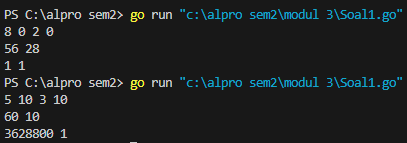
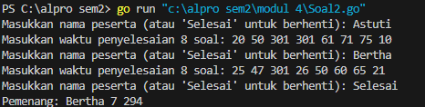
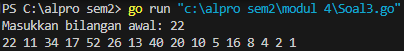

<h1 align="center">Laporan Praktikum Modul 4 <br>Prosedur</h1>
<p align="center">Chilya Fadhilatin Nisa - 103112430010</p>

## Dasar Teori
Dalam bahasa Go (Golang), **materi prosedur** biasanya mengacu pada fungsi (function) yang digunakan untuk mengeksekusi serangkaian instruksi tanpa mengembalikan nilai. Dalam beberapa bahasa pemrograman lain, istilah _prosedur_ merujuk pada subprogram yang tidak mengembalikan nilai (seperti `void` function di C/C++), tapi di Golang, semua fungsi disebut **function**, baik yang mengembalikan nilai maupun tidak. 
## Unguided

### Soal Latihan Modul 4

#### Soal 1

> Minggu ini, mahasiswa Fakultas Informatika mendapatkan tugas dari mata kuliah matematika diskrit untuk mempelajari kombinasi dan permutasi. Jonas salah seorang mahasiswa, iseng untuk mengimplementasikannya ke dalam suatu program. Oleh karena itu bersediakah kalian membantu Jonas?

```go
package main
import (

    "fmt"
)

func factorial(n int) int {
    if n == 0 || n == 1 {
        return 1
    }
    result := 1
    for i := 2; i <= n; i++ {
        result *= i
    }
    return result
}

func permutation(n, r int) int {
    return factorial(n) / factorial(n-r)
}

func combination(n, r int) int {
    return factorial(n) / (factorial(r) * factorial(n-r))
}

func main() {
    var a, b, c, d int
    fmt.Scan(&a, &b, &c, &d)

    if a >= c && b >= d {
        fmt.Println(permutation(a, c), combination(a, c))
        fmt.Println(permutation(b, d), combination(b, d))

    } else {
        fmt.Println("Input tidak memenuhi syarat a >= c dan b >= d")
    }
}
```



Program ini ditulis dalam bahasa Golang untuk menghitung permutasi dan kombinasi dari dua pasang bilangan. Program ini menggunakan tiga fungsi utama:
1. `factorial(n)`, yang menghitung faktorial suatu bilangan.
2. `permutation(n, r)`, yang menghitung permutasi dengan rumus P(n,r)=n!/(n−r)!P(n, r) = n! / (n-r)!.
3. `combination(n, r)`, yang menghitung kombinasi dengan rumus C(n,r)=n!/(r!(n−r)!)C(n, r) = n! / (r!(n-r)!).
Program membaca empat bilangan sebagai input, kemudian menghitung permutasi dan kombinasi untuk masing-masing pasangan bilangan jika memenuhi syarat a≥ca \geq c dan b≥db \geq d. Jika syarat tidak terpenuhi, program menampilkan pesan bahwa input tidak memenuhi ketentuan.

#### Soal 2

>Kompetisi pemrograman tingkat nasional berlangsung ketat. Setiap peserta diberikan 8 soal yang harus dapat diselesaikan dalam waktu 5 jam saja. Peserta yang berhasil menyelesaikan soal paling banyak dalam waktu paling singkat adalah pemenangnya.

```go
package main

import (
    "fmt"
    "math"
)

const MAX_TIME = 301

func hitungSkor(times []int) (int, int) {
    soal := 0
    totalWaktu := 0
  
    for _, t := range times {
        if t < MAX_TIME {
            soal++
            totalWaktu += t
        }
    }

    return soal, totalWaktu
}

func main() {
    var nama, pemenang string
    var waktu [8]int
    var soal, skor int
    var maxSoal, minWaktu int = 0, math.MaxInt32

    for {
        fmt.Print("Masukkan nama peserta (atau 'Selesai' untuk berhenti): ")
        fmt.Scan(&nama)
        if nama == "Selesai" {
            break
        }

        fmt.Print("Masukkan waktu penyelesaian 8 soal: ")
        for i := 0; i < 8; i++ {
            fmt.Scan(&waktu[i])
        }

        soal, skor = hitungSkor(waktu[:])

        if soal > maxSoal || (soal == maxSoal && skor < minWaktu) {
            maxSoal = soal
            minWaktu = skor
            pemenang = nama
        }
    }

    if pemenang != "" {
        fmt.Printf("Pemenang: %s %d %d\n", pemenang, maxSoal, minWaktu)
    } else {
        fmt.Println("Tidak ada peserta.")
    }

}
```



Program ini mencari pemenang kompetisi pemrograman berdasarkan jumlah soal yang diselesaikan dan total waktu pengerjaan.

1. **Prosedur `hitungSkor`** menghitung jumlah soal yang berhasil dikerjakan dan total waktu pengerjaannya. Soal yang tidak diselesaikan dianggap dikerjakan dalam 301 menit.
2. **Di dalam `main`**, program membaca nama peserta dan waktu pengerjaan 8 soal, lalu memprosesnya dengan `hitungSkor`.
3. Pemenang ditentukan berdasarkan jumlah soal terbanyak. Jika sama, peserta dengan total waktu pengerjaan paling sedikit yang menang.
4. Program terus menerima input hingga pengguna mengetik "Selesai", lalu menampilkan pemenang atau pesan jika tidak ada peserta.

#### Soal 3

>Skiena dan Revilla dalam Programming Challenges mendefinisikan sebuah deret bilangan. Deret dimulai dengan sebuah bilangan bulat n. Jika bilangan n saat itu genap, maka suku berikutnya adalah ½n, tetapi jika ganjil maka suku berikutnya bernilai 3n+1. Rumus yang sama digunakan terus menerus untuk mencari suku berikutnya.

```go
package main

import (
    "fmt"
)

func cetakDeret(n int) {
    for n != 1 {
        fmt.Print(n, " ")
        if n%2 == 0 {
            n /= 2
        } else {
            n = 3*n + 1
        }
    }
    fmt.Println(n)
}

func main() {
    var n int
    fmt.Print("Masukkan bilangan awal: ")
    fmt.Scan(&n)

    if n > 0 && n < 1000000 {
        cetakDeret(n)
    } else {
        fmt.Println("Masukkan angka positif kurang dari 1.000.000")
    }
}
```



- **Prosedur `cetakDeret(n int)`**
    - Mencetak deret bilangan sesuai aturan Skiena dan Revilla.
    - Jika bilangan genap, dibagi 2.
    - Jika bilangan ganjil, dikalikan 3 lalu ditambah 1.
    - Berhenti ketika mencapai angka 1.
    
- **Fungsi `main()`**
    - Meminta input bilangan awal.
    - Memeriksa apakah bilangan berada dalam rentang yang diperbolehkan (1 hingga kurang dari 1.000.000).
    - Memanggil prosedur `cetakDeret` untuk mencetak deret.