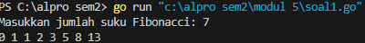
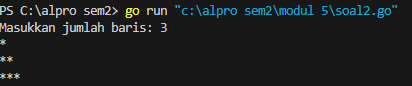
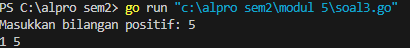
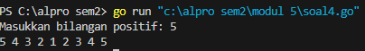
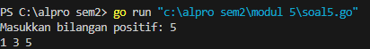
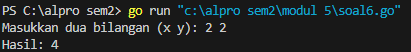

<h1 align="center">Laporan Praktikum Modul 5 <br>Rekursif</h1>
<p align="center">Chilya Fadhilatin Nisa - 103112430010</p>

## Dasar Teori
Rekursi adalah **proses mendefinisikan masalah (atau solusi untuk masalah) dalam bentuk (versi yang lebih sederhana) dari dirinya sendiri** . Misalnya, kita dapat mendefinisikan operasi "temukan jalan pulang" sebagai: Jika Anda di rumah, berhentilah bergerak. Ambil satu langkah menuju rumah. 
## Unguided

### Soal Latihan Modul 5

#### Soal 1

>Deret fibonacci adalah sebuah deret dengan nilai suku ke-0 dan ke-1 adalah 0 dan 1, dan nilai  
   suku ke-n selanjutnya adalah hasil penjumlahan dua suku sebelumnya. Secara umum dapat  
   diformulasikan 𝑆𝑛 = 𝑆𝑛-1 + 𝑆𝑛-2 . Berikut ini adalah contoh nilai deret fibonacci hingga suku  
   ke-10. Buatlah program yang mengimplementasikan fungsi rekursif pada deret fibonacci  
   tersebut.

```go
package main
import "fmt"

func fibonacci(n int) int {
    if n == 0 {
        return 0
    } else if n == 1 {
        return 1
    } else {
        return fibonacci(n-1) + fibonacci(n-2)
    }
}

func main() {
    var n int
    fmt.Print("Masukkan jumlah suku Fibonacci: ")
    fmt.Scan(&n)

    if n < 0 {
        fmt.Println("Masukkan harus bilangan positif")
        return
    }

    for i := 0; i <= n; i++ {
        fmt.Print(fibonacci(i), " ")
    }
    fmt.Println()
}
```



Program ini menghitung deret Fibonacci menggunakan rekursi dalam bahasa Go. Fungsi `fibonacci(n int) int` mengembalikan nilai Fibonacci ke-`n` berdasarkan:
- `0` jika `n == 0`,
- `1` jika `n == 1`,
- `fibonacci(n-1) + fibonacci(n-2)` untuk nilai `n` lebih besar.
Di `main()`, program meminta input `n`, lalu mencetak deret Fibonacci dari `0` hingga `n`. Jika `n` negatif, program menampilkan pesan error.

#### Soal 2

>Buatlah sebuah program yang digunakan untuk menampilkan pola bintang berikut ini dengan  
  menggunakan fungsi rekursif. N adalah masukan dari user.

```go
package main
import "fmt"

func cetakBaris(n int) {
    if n > 0 {
        fmt.Print("*")
        cetakBaris(n - 1)
    }
}

func cetakPola(n, i int) {
    if i <= n {
        cetakBaris(i)
        fmt.Println()
        cetakPola(n, i+1)
    }
}

func main() {
    var n int
    fmt.Print("Masukkan jumlah baris: ")
    fmt.Scan(&n)

    if n <= 0 {
        fmt.Println("Masukkan harus bilangan positif.")
        return
    }

    cetakPola(n, 1)
}
```



Program ini mencetak pola segitiga bintang secara rekursif menggunakan bahasa Go. Fungsi `cetakBaris(n int)` mencetak `n` bintang dalam satu baris secara rekursif, sedangkan fungsi `cetakPola(n, i int)` mencetak pola bintang dari 1 hingga `n` baris. Di dalam `main()`, program meminta input `n` sebagai jumlah baris. Jika `n` ≤ 0, program menampilkan pesan error. Jika valid, fungsi `cetakPola(n, 1)` dipanggil untuk mencetak pola bintang bertingkat.

#### Soal 3

>Buatlah program yang mengimplementasikan rekursif untuk menampilkan faktor bilangan dari  
   suatu N, atau bilangan yang apa saja yang habis membagi N.

```go
package main
import "fmt"

func cetakFaktor(n, i int) {
    if i > n {
        return
    }

    if n%i == 0 {
        fmt.Print(i, " ")
    }
    cetakFaktor(n, i+1)
}

func main() {
    var n int
    fmt.Print("Masukkan bilangan positif: ")
    fmt.Scan(&n)

    if n <= 0 {
        fmt.Println("Masukkan harus bilangan positif.")
        return
    }

    cetakFaktor(n, 1)
    fmt.Println()
}
```



Program ini menggunakan rekursi untuk mencetak semua faktor dari sebuah bilangan positif dalam bahasa Go. Fungsi `cetakFaktor(n, i int)` akan memeriksa apakah `i` adalah faktor dari `n` dengan mengecek apakah `n % i == 0`. Jika iya, `i` dicetak. Fungsi ini terus dipanggil secara rekursif dengan `i+1` hingga `i` melebihi `n`. Di dalam fungsi `main()`, program meminta input bilangan `n`. Jika `n` ≤ 0, program menampilkan pesan error. Jika valid, program memanggil `cetakFaktor(n, 1)` untuk mencetak semua faktor dari `n`.

#### Soal 4

>Buatlah program yang mengimplementasikan rekursif untuk menampilkan barisan bilangan  
   tertentu.

```go
package main
import "fmt"

func turun(n int) {
    if n < 1 {
        return
    }
    fmt.Print(n, " ")
    turun(n - 1)
}

func naik(i, n int) {
    if i > n {
        return
    }
    fmt.Print(i, " ")
    naik(i+1, n)
}

func main() {
    var n int
    fmt.Print("Masukkan bilangan positif: ")
    fmt.Scan(&n)

    if n <= 0 {
        fmt.Println("Masukkan harus bilangan positif.")
        return
    }

    turun(n)  
    naik(2, n)
    fmt.Println()
}
```



Program ini menggunakan rekursi untuk mencetak semua faktor dari sebuah bilangan positif dalam bahasa Go. Fungsi `cetakFaktor(n, i int)` akan memeriksa apakah `i` adalah faktor dari `n` dengan mengecek apakah `n % i == 0`. Jika iya, `i` dicetak. Fungsi ini terus dipanggil secara rekursif dengan `i+1` hingga `i` melebihi `n`. Di dalam fungsi `main()`, program meminta input bilangan `n`. Jika `n` ≤ 0, program menampilkan pesan error. Jika valid, program memanggil `cetakFaktor(n, 1)` untuk mencetak semua faktor dari `n`.

#### Soal 5

>Buatlah program yang mengimplementasikan rekursif untuk menampilkan barisan bilangan ganjil.

```go
package main
import "fmt"

func cetakGanjil(i, n int) {
    if i > n {
        return
    }

    fmt.Print(i, " ")  
    cetakGanjil(i+2, n)
}

func main() {
    var n int
    fmt.Print("Masukkan bilangan positif: ")
    fmt.Scan(&n)

    if n <= 0 {
        fmt.Println("Masukkan harus bilangan positif.")
        return
    }

    cetakGanjil(1, n)
    fmt.Println()
    
    }
   ```



Program ini menggunakan rekursi untuk mencetak semua bilangan ganjil dari 1 hingga `n` dalam bahasa Go. Fungsi `cetakGanjil(i, n int)` akan mencetak nilai `i` jika masih dalam batas `n`, lalu memanggil dirinya sendiri dengan `i+2`, memastikan hanya bilangan ganjil yang diproses.
Di dalam fungsi `main()`, program meminta input bilangan `n`. Jika `n` ≤ 0, program akan menampilkan pesan error. Jika valid, program memanggil `cetakGanjil(1, n)`, yang memulai pencetakan dari 1 dan terus bertambah 2 hingga mencapai atau melewati `n`.

#### Soal 6

>Buatlah program yang mengimplementasikan rekursif untuk mencari hasil pangkat dari dua  
   buah bilangan.

```go
package main
import (
    "fmt"
)

func power(x, y int) int {
    if y == 0 {
        return 1
    }
    return x * power(x, y-1)
}

func main() {
    var x, y int
    fmt.Print("Masukkan dua bilangan (x y): ")
    fmt.Scan(&x, &y)
    fmt.Println("Hasil:", power(x, y))
}
```



Program ini menghitung hasil perpangkatan `x^y` menggunakan rekursi dalam bahasa Go. Fungsi `power(x, y int)` menerima dua bilangan, yaitu `x` sebagai basis dan `y` sebagai eksponen. Jika `y` bernilai 0, fungsi mengembalikan 1 karena setiap bilangan yang dipangkatkan 0 hasilnya selalu 1. Jika tidak, fungsi mengalikan `x` dengan hasil rekursif `power(x, y-1)`, yang secara bertahap mengurangi eksponen hingga mencapai 0.
Di dalam fungsi `main()`, program meminta input dua bilangan dari pengguna, yaitu `x` dan `y`. Setelah menerima input, program memanggil fungsi `power(x, y)` untuk menghitung hasil perpangkatan, lalu mencetaknya.
