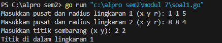
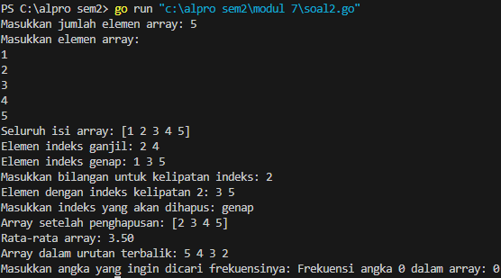
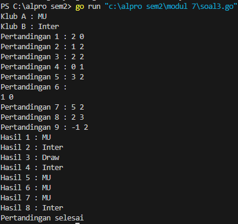
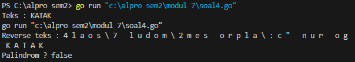

# <h1 align="center">Laporan Praktikum Modul 7 <br>Struct Array</h1>
<p align="center">Chilya Fadhilatin Nisa - 103112430010</p>

## Dasar Teori
**Array mengacu pada koleksi yang terdiri dari elemen-elemen bertipe data homogen.** **Struktur mengacu pada koleksi yang terdiri dari elemen-elemen bertipe data heterogen** . Array menggunakan subskrip atau “[ ]” (kurung siku) untuk akses elemen. Struktur menggunakan “.” (operator titik) untuk akses elemen.

# Unguided
___
# SOAL LATIHAN MODUL 7
### No. 1
Suatu lingkaran didefinisikan dengan koordinat titik pusat (𝑐𝑥, 𝑐𝑦) dengan radius 𝑟. Apabila diberikan dua buah lingkaran, maka tentukan posisi sebuah titik sembarang (𝑥, 𝑦) berdasarkan dua lingkaran tersebut. Gunakan tipe bentukan titik untuk menyimpan koordinat, dan tipe bentukan lingkaran untuk menyimpan titik pusat lingkaran dan radiusnya. 

Masukan terdiri dari beberapa tiga baris. Baris pertama dan kedua adalah koordinat titik pusat dan radius dari lingkaran 1 dan lingkaran 2, sedangkan baris ketiga adalah koordinat titik sembarang. Asumsi sumbu x dan y dari semua titik dan juga radius direpresentasikan dengan bilangan bulat. 

Keluaran berupa string yang menyatakan posisi titik "Titik di dalam lingkaran 1 dan 2", "Titik di dalam lingkaran 1", "Titik di dalam lingkaran 2", atau "Titik di luar lingkaran 1 dan 2".

```go
package main

import (
    "fmt"
    "math"
)

type Titik struct {
    x, y int
}

type Lingkaran struct {
    pusat  Titik
    radius int
}

func Jarak(p, q Titik) float64 {
    return math.Sqrt(math.Pow(float64(p.x-q.x), 2) + math.Pow(float64(p.y-q.y), 2))
}

func Didalam(c Lingkaran, p Titik) bool {
    return Jarak(c.pusat, p) <= float64(c.radius)
}

func main() {
    var L1, L2 Lingkaran
    var P Titik

    fmt.Print("Masukkan pusat dan radius lingkaran 1 (x y r): ")
    fmt.Scan(&L1.pusat.x, &L1.pusat.y, &L1.radius)

    fmt.Print("Masukkan pusat dan radius lingkaran 2 (x y r): ")
    fmt.Scan(&L2.pusat.x, &L2.pusat.y, &L2.radius)

    fmt.Print("Masukkan titik sembarang (x y): ")
    fmt.Scan(&P.x, &P.y)

    diDalamL1 := Didalam(L1, P)
    diDalamL2 := Didalam(L2, P)

    if diDalamL1 && diDalamL2 {
        fmt.Println("Titik di dalam lingkaran 1 dan 2")
    } else if diDalamL1 {
        fmt.Println("Titik di dalam lingkaran 1")
    } else if diDalamL2 {
        fmt.Println("Titik di dalam lingkaran 2")
    } else {
        fmt.Println("Titik di luar lingkaran 1 dan 2")

    }
}
```

> Output
> 

- **Struct `Titik` dan `Lingkaran`:**
    - `Titik` menyimpan koordinat `x` dan `y`.
    - `Lingkaran` menyimpan `pusat` (tipe `Titik`) dan `radius`.
        
- **Fungsi `Jarak(p, q)`:**  
    Menghitung jarak antara dua titik menggunakan rumus:
    jarak=(x1−x2)2+(y1−y2)2\text{jarak} = \sqrt{(x1 - x2)^2 + (y1 - y2)^2}jarak=(x1−x2)2+(y1−y2)2​
    
- **Fungsi `Didalam(c, p)`:**  
    Mengecek apakah titik `p` berada **di dalam lingkaran `c`** dengan membandingkan jarak titik ke pusat lingkaran dengan radius.
    
- **Fungsi `main()`:**
    - Input: dua lingkaran (`x`, `y`, `radius`) dan satu titik sembarang (`x`, `y`).
    - Program memanggil fungsi `Didalam` untuk menentukan posisi titik terhadap dua lingkaran.
    - Output: menampilkan apakah titik berada di:
        - Dalam kedua lingkaran
        - Salah satu lingkaran
        - Atau di luar semua lingkaran

### No. 2
Sebuah array digunakan untuk menampung sekumpulan bilangan bulat. Buatlah program bahasa go yang digunakan untuk mengisi array tersebut sebanyak N elemen nilai. Asumsikan array memiliki kapasitas penyimpanan data sejumlah elemen tertentu. Program dapat menampilkan beberapa informasi berikut:
a. Menampilkan keseluruhan isi dari array. 
b. Menampilkan elemen-elemen array dengan indeks ganjil saja. 
c. Menampilkan elemen-elemen array dengan indeks genap saja (asumsi indek ke-0 adalah genap). 
d. Menampilkan elemen-elemen array dengan indeks kelipatan bilangan x. x bisa diperoleh dari masukan pengguna. 
e. Menghapus elemen array pada indeks tertentu, asumsi indeks yang hapus selalu valid. Tampilkan keseluruhan isi dari arraynya, pastikan data yang dihapus tidak tampil 
f. Menampilkan rata-rata dari bilangan yang ada di dalam array. 
g. Menampilkan standar deviasi atau simpangan baku dari bilangan yang ada di dalam array tersebut. h. Menampilkan frekuensi dari suatu bilangan tertentu di dalam array yang telah diisi tersebut.

```go
package main

  

import (

    "fmt"

)

  

func rataRata(arr []int) float64 {

    total := 0

    for _, val := range arr {

        total += val

    }

    return float64(total) / float64(len(arr))

}

  

func hitungFrekuensi(arr []int, target int) int {

    frek := 0

    for _, val := range arr {

        if val == target {

            frek++

        }

    }

    return frek

}

  

func main() {

    var n, x, target int

  

    fmt.Print("Masukkan jumlah elemen array: ")

    fmt.Scan(&n)

  

    arr := make([]int, n)

  

    fmt.Println("Masukkan elemen array:")

    for i := 0; i < n; i++ {

        fmt.Scan(&arr[i])

    }

  

    fmt.Println("Seluruh isi array:", arr)

  

    fmt.Print("Elemen indeks ganjil: ")

    for i := 1; i < n; i += 2 {

        fmt.Print(arr[i], " ")

    }

    fmt.Println()

  

    fmt.Print("Elemen indeks genap: ")

    for i := 0; i < n; i += 2 {

        fmt.Print(arr[i], " ")

    }

    fmt.Println()

  

    fmt.Print("Masukkan bilangan untuk kelipatan indeks: ")

    fmt.Scan(&x)

    fmt.Print("Elemen dengan indeks kelipatan ", x, ": ")

    for i := x; i < n; i += x {

        fmt.Print(arr[i], " ")

    }

    fmt.Println()

  

    var indeksHapus int

    fmt.Print("Masukkan indeks yang akan dihapus: ")

    fmt.Scan(&indeksHapus)

  

    if indeksHapus >= 0 && indeksHapus < n {

        arr = append(arr[:indeksHapus], arr[indeksHapus+1:]...)

        fmt.Println("Array setelah penghapusan:", arr)

    } else {

        fmt.Println("Indeks tidak valid!")

    }

  

    fmt.Printf("Rata-rata array: %.2f\n", rataRata(arr))

  

    fmt.Print("Array dalam urutan terbalik: ")

    for i := len(arr) - 1; i >= 0; i-- {

        fmt.Print(arr[i], " ")

    }

    fmt.Println()

  

    fmt.Print("Masukkan angka yang ingin dicari frekuensinya: ")

    fmt.Scan(&target)

    fmt.Printf("Frekuensi angka %d dalam array: %d\n", target, hitungFrekuensi(arr, target))

}
```

> Output
> 

Program Go ini memproses array bilangan bulat dengan berbagai fitur: input array, menampilkan elemen indeks ganjil/genap/kelipatan tertentu, menghapus elemen berdasarkan indeks, menghitung rata-rata, menampilkan array terbalik, dan mencari frekuensi kemunculan angka tertentu dalam array. Program ini berguna untuk latihan manipulasi array dan penggunaan fungsi dasar dalam Go.

### No. 3
Sebuah program bahasa go digunakan untuk menyimpan dan menampilkan nama-nama klub yang memenangkan pertandingan bola pada suatu grup pertandingan. 
Buatlah program yang digunakan untuk merekap skor pertandingan bola 2 buah klub bola yang berlaga. Pertama-tama program meminta masukan nama-nama klub yang bertanding, kemudian program meminta masukan skor hasil pertandingan kedua klub tersebut. Yang disimpan dalam array adalah nama-nama klub yang menang saja. 
Proses input skor berhenti ketika skor salah satu atau kedua klub tidak valid (negatif). Di akhir program, tampilkan daftar klub yang memenangkan pertandingan.

```go
package main

  

import (

    "fmt"

)

  

func main() {

    var klubA, klubB string

    var skorA, skorB int

    var hasil []string

  

    fmt.Print("Klub A : ")

    fmt.Scanln(&klubA)

    fmt.Print("Klub B : ")

    fmt.Scanln(&klubB)

  

    pertandingan := 1

    for {

        fmt.Printf("Pertandingan %d : ", pertandingan)

        fmt.Scan(&skorA, &skorB)

  

        if skorA < 0 || skorB < 0 {

            break

        }

  

        if skorA > skorB {

            hasil = append(hasil, klubA)

        } else if skorB > skorA {

            hasil = append(hasil, klubB)

        } else {

            hasil = append(hasil, "Draw")

        }

  

        pertandingan++

    }

  

    for i, v := range hasil {

        fmt.Printf("Hasil %d : %s\n", i+1, v)

    }

    fmt.Println("Pertandingan selesai")

}
```

> Output
> 

1. **Input Nama Klub:**
    - User diminta memasukkan nama dua klub.
        
2. **Input Skor Pertandingan (Berulang):**
    - Memasukkan skor Klub A dan Klub B secara berulang untuk setiap pertandingan.
    - Pengulangan berhenti jika salah satu skor bernilai negatif.
        
3. **Penentuan Hasil:**
    - Jika skor Klub A > Klub B → Klub A menang.
    - Jika skor Klub B > Klub A → Klub B menang.
    - Jika sama → hasil "Draw".
    - Setiap hasil disimpan ke dalam slice `hasil`.
        
4. **Output:**
    - Menampilkan hasil tiap pertandingan yang telah dimasukkan.
    - Menutup program dengan pesan "Pertandingan selesai".

### No. 4
Sebuah array digunakan untuk menampung sekumpulan karakter, Anda diminta untuk membuat sebuah subprogram untuk melakukan membalikkan urutan isi array dan memeriksa apakah membentuk palindrom.

```go
package main

  

import (

    "fmt"

)

  

const NMAX int = 127

type tabel [NMAX]rune

  

func isiArray(t *tabel, n *int) {

    var input rune

    for {

        fmt.Scanf("%c", &input)

        if input == '.' || *n >= NMAX {

            break

        }

        (*t)[*n] = input

        *n++

    }

}

  

func cetakArray(t tabel, n int) {

    for i := 0; i < n; i++ {

        fmt.Printf("%c ", t[i])

    }

    fmt.Println()

}

  

func balikanArray(t *tabel, n int) {

    for i := 0; i < n/2; i++ {

        t[i], t[n-1-i] = t[n-1-i], t[i]

    }

}

  

func palindrom(t tabel, n int) bool {

    for i := 0; i < n/2; i++ {

        if t[i] != t[n-1-i] {

            return false

        }

    }

    return true

}

  

func main() {

    var tab tabel

    var m int

  

    fmt.Print("Teks : ")

    isiArray(&tab, &m)

  

    fmt.Print("Reverse teks : ")

    balikanArray(&tab, m)

    cetakArray(tab, m)

  

    if palindrom(tab, m) {

        fmt.Println("Palindrom ? true")

    } else {

        fmt.Println("Palindrom ? false")

    }

}
```

> Output
> 

Program ini membaca deretan karakter dari input hingga tanda titik (`.`), menyimpannya dalam array, lalu menampilkan versi terbaliknya dan mengecek apakah karakter tersebut membentuk **palindrom** (dibaca dari depan dan belakang sama). Jika ya, tampilkan `Palindrom ? true`, jika tidak `false`.